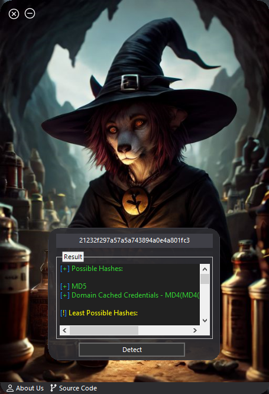

<head>
  <meta name="google-site-verification" content="l4gzIHopgDDt57xRYeRvJZ5DYgg4lLb-qPciUxhNxkY" />
</head>

# Charon Hash Detector

## Project Porgrammer
> AmirHossein Ghanami (Ch4120N) - Ch4120ni@Gmail.com

## Made For
> Detect the hash that you don't know the algorithm of

## 👀 Screenshot

## ⚓ Requires
> .NET Framework 4.6 | Telerik WinForms

## Supported Operating Systems
- [X] Windows 10
- [X] Windows 8.1
- [X] Windows 8
- [X] Windows 7

## ✨ Features

* Good Design
* Very High Speed
* Advanced Error Handling
* Finding The All Algorithm Hash Possible
* Sound Effects
* Easy and attractive user interface

## 📝️ How it Works?
First, Insert your hash in to hash input then click on `Detect` Button for Detecting Your Algorithm Hash and Showing Results on Result Area

## ⚠️ Legal disclaimer ⚠️
> Usage of `Charon Hash Detector` for attacking targets without prior mutual consent is illegal. It's the end user's responsibility to obey all applicable local, state and federal laws. Developers assume no liability and are not responsible for any misuse or damage caused by this program.

## ❤️ Donation 
> bitcoin:   bc1ql4syps7qpa3djqrxwht3g66tldyh4j7qsyjkq0

## ☠️ Reporting Issues

If you are facing a configuration issue or something is not working as you expected to be, please use the **Ch4120ni@Gmail.com**

## License
* [CGBL](https://Ch4120N.github.io/CGBL)